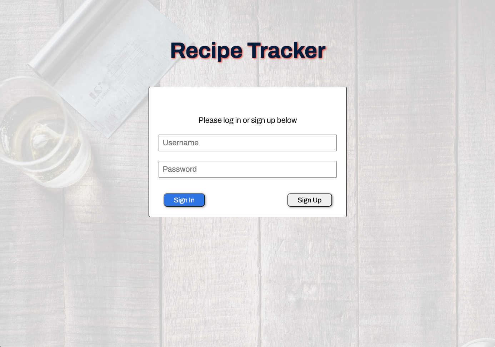
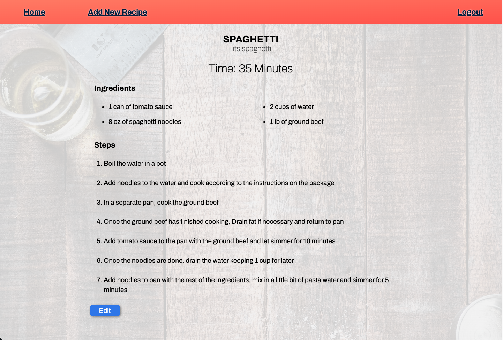
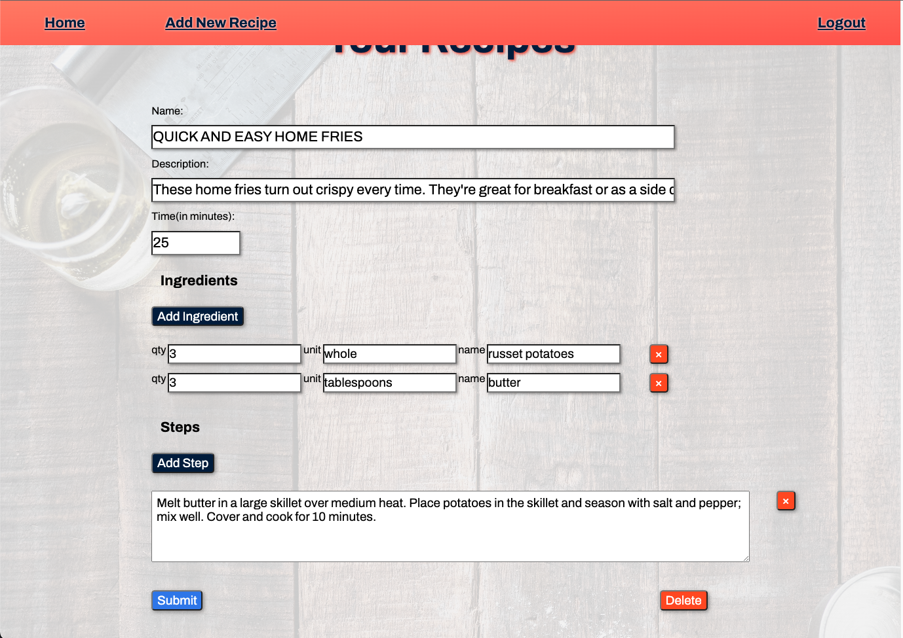
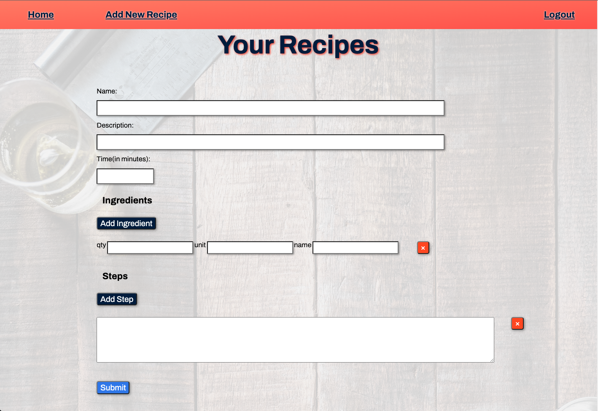

# Recipe Tracker

This is a very simple recipe tracker app that allows you to store all of your favorite recipes in one place. Simply create a profile, login and start adding recipes to your collection now.

## Techonolgies Used

---

- Javascript
- HTML
- CSS

## Getting started

---

Click the link [here](https://briant1312.github.io/project-2-client/) to start using the app

Instructions: 

- create a profile and login
- hit the "add new recipe" link in the nav and start adding to your collection
- click the recipe name to view that recipe
- click the edit button on the show page to edit or delete that recipe

## Next Steps

---

### Version 2:

- As a user, I want to be able to choose different themes for the app
- As a user, I want to be able to rate recipes
- As a user, I want to organize my recipes in categories
- As a user, I want to be able to add a profile picture
- As a user, I want to be able to add pictures for recipes

### Version 3:

- As a user, I want to be able to share recipes with friends
- As a user, I want to be able to be able to view and like other peoples recipes